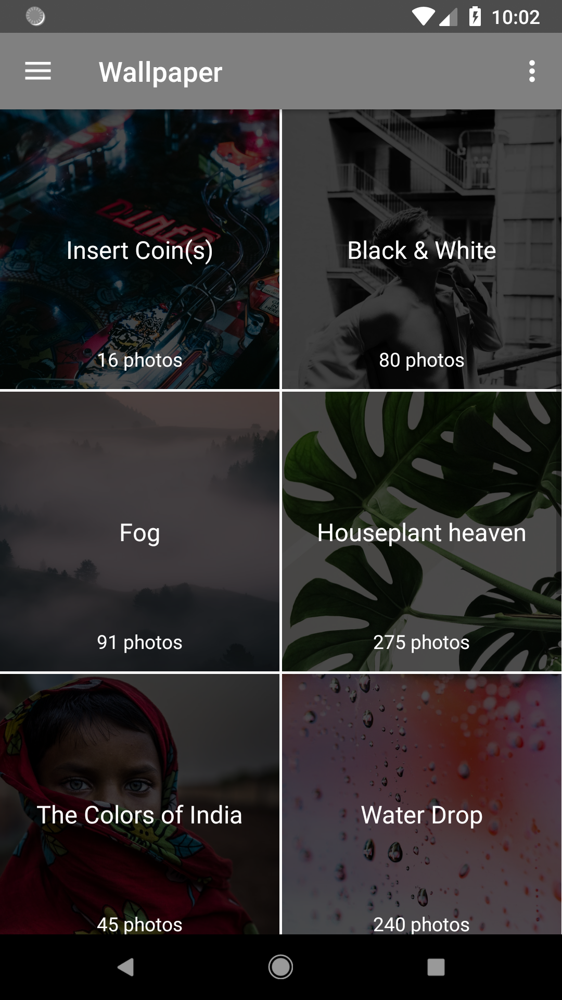

# Wallpaper

**Wallpaper Android Application.** This application lists all best images, collections from Unsplash. You can also bookmark, save image to your phone, and set wallpaper. A very smooth application from this course: [Advanced Android: Create a Real-REST API Client Application](https://www.udemy.com/advanced-android-development/learn/v4/content)

## What our application looks like ?

  
  
  
  

## Built with

- Retrofit
- GSON
- Realm
- ButterKnife
- Glide

## To-do
- When view image full screen, back to previous page when drag image down
- Refresh favorite list when remove favorite (when view image full screen inside favorite list)
